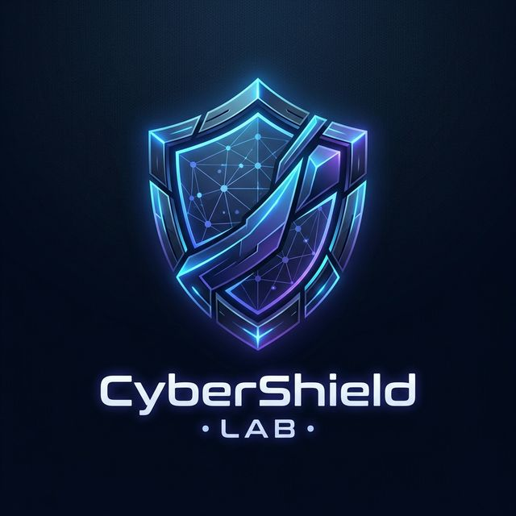
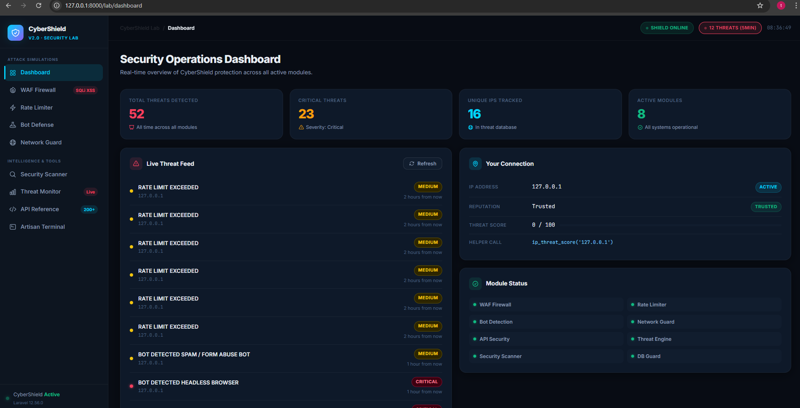
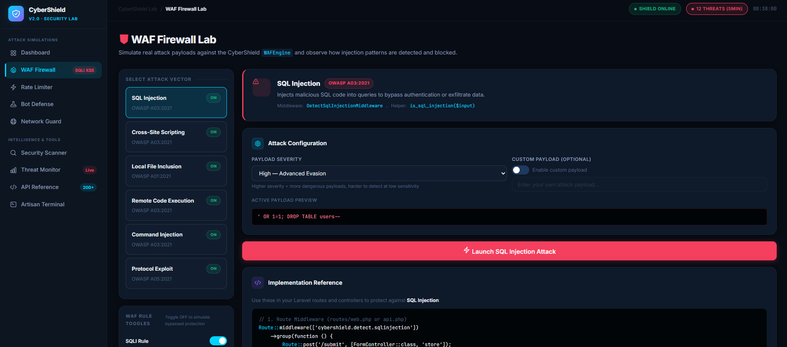
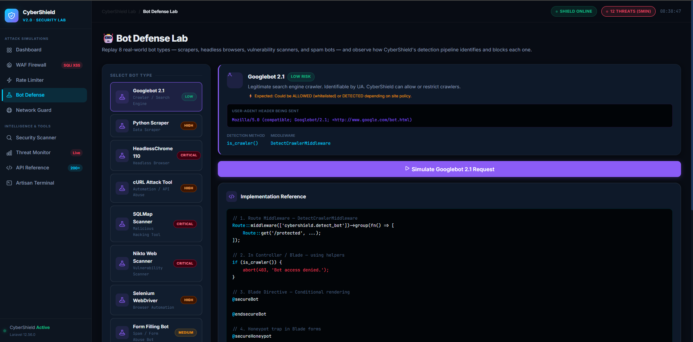
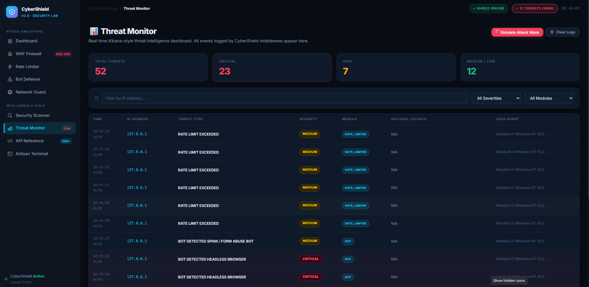
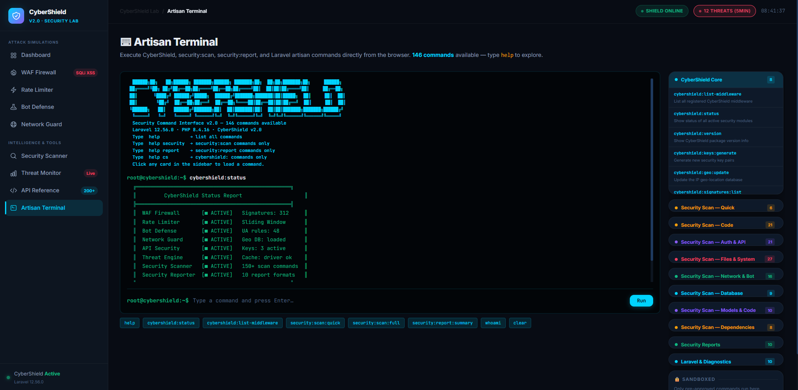
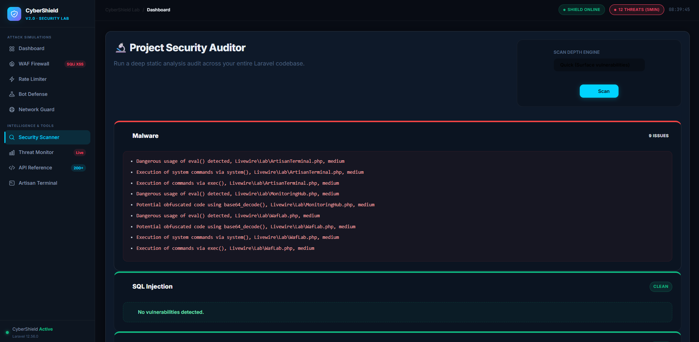

<p align="center">
  
</p>

<p align="center">
  <a href="https://github.com/subhashladumor1/laravel-cybershield"></a>
  <a href="https://php.net"></a>
  <a href="https://laravel.com"></a>
  <a href="https://opensource.org/licenses/MIT"></a>
</p>

---

# 🛡️ Laravel CyberShield Lab

**CyberShield Lab** is an interactive, premium security simulation platform designed to showcase the power of the `laravel-cybershield` package. It provides a hands-on environment for developers and security enthusiasts to understand, test, and master modern web security defenses.

> [!TIP]
> This lab is completely **Open Source** and built for **learning purposes**. It allows you to simulate real-world attacks (SQLi, XSS, Bot scrapers) and see how CyberShield defends your application in real-time.

---

## ✨ Visual Showcase

Experience the professional-grade security dashboard and interactive labs built with **Livewire 3** and **Tailwind CSS**.

| 🚀 Security Dashboard | 🛡️ WAF Firewall Lab |
|:---:|:---:|
|  |  |

| 🤖 Bot Defense Lab | 📊 Threat Monitoring |
|:---:|:---:|
|  |  |

| 💻 Artisan Terminal | 🕵️ Security Scanner |
|:---:|:---:|
|  |  |

---

## 🛠️ Core Security Modules

CyberShield Lab demonstrates 8+ core modules that provide a 360° security perimeter for your Laravel applications:

- **🔥 WAF (Web Application Firewall):** Detect and block SQL Injection, XSS, LFI, RCE, and Command Injection with ultra-fast signature matching.
- **🤖 Bot Defense:** Identify and mitigate malicious crawlers, headless browsers, and automation tools using behavioral analysis.
- **⏳ Adaptive Rate Limiting:** Prevent brute-force and DDoS attacks using Sliding Window and Token Bucket algorithms.
- **🌍 Network Guard:** Implementation of Geo-blocking, IP Blacklisting, and TOR exit-node detection.
- **🧩 API Security:** Secure your endpoints with request signing, HMAC verification, and behavior-based anomaly detection.
- **🚨 Threat Monitoring:** A centralized hub to search, analyze, and export security logs with Kibana-style filtering.
- **📟 Artisan Command Suite:** 150+ powerful CLI commands for security scanning, auditing, and automated fixes.

---

## 🚀 Quick Start

Follow these steps to get your own security lab running in minutes:

### 1. Clone the Repository
```bash
git clone https://github.com/subhashladumor1/laravel-cybershield-lab.git
cd laravel-cybershield-lab
```

### 2. Install Dependencies
```bash
composer install
npm install
```

### 3. Setup Environment
```bash
cp .env.example .env
php artisan key:generate
touch database/database.sqlite
php artisan migrate --seed
```

### 4. Launch the Lab
```bash
php artisan serve
# In a separate terminal
npm run dev
```
Visit `http://localhost:8000` to start your security journey!

---

## 🧪 How to Test CyberShield

The Lab is designed to be "breakable" so you can learn how to "fix" it.

### **The WAF Lab**
1. Navigate to **WAF Firewall Lab**.
2. Select an attack type (e.g., **SQL Injection**).
3. Click **"Trigger Attack"** — you'll see the request is **BLOCKED (403)**.
4. Toggle the protection **OFF** and trigger again — you'll see the payload **BYPASSES** the firewall and reaches the application.

### **The Monitoring Hub**
1. After triggering a few attacks, go to the **Monitoring Hub**.
2. See real-time logs of blocked IPs, attack types, and severity levels.
3. Export your findings as **CSV** or **JSON** for further analysis.

### **The Artisan Terminal**
1. Open the interactive **Artisan Terminal** in the app.
2. Run `security:scan:quick` to see a rapid security audit.
3. Use `cybershield:status` to verify which modules are shielding your application.

---

## 📖 Deep Dive Documentation

Learn more about the core package that powers this lab:

- **Main Package:** [subhashladumor1/laravel-cybershield](https://github.com/subhashladumor1/laravel-cybershield)
- **Features Wiki:** Coming Soon!
- **Contribution Guide:** We welcome PRs to make the lab even better!

---

## 🤝 Credits & Support

Created by **[Subhash Ladumor](https://github.com/subhashladumor1)**.

If you find this lab helpful for learning Laravel security, please consider giving the **[laravel-cybershield](https://github.com/subhashladumor1/laravel-cybershield)** package a ⭐!

---

<p align="center">
  Released under the <strong>MIT License</strong>.<br>
  Built with ❤️ for the Laravel Community.
</p>
